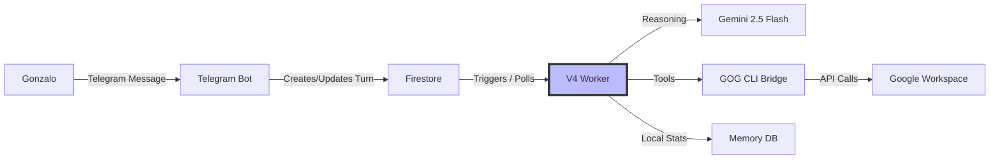

# C4 Container: OpenGravity V4

## Containers

| Container | Description | Technology | Purpose |
|-----------|-------------|------------|---------|
| **Telegram Bot** | Ingestion point for user interaction. Handles webhooks/polling and voice transcription. | Node.js / Telegraf | Interface |
| **Worker (ProcessTurn)** | The asynchronous engine. Orchestrates LLM calls and tool execution. | TypeScript / Node.js | Logic Engine |
| **Firestore** | Persistent storage for conversation turns, message history, and user state. | Firebase Firestore | Database |
| **Memory DB** | Local SQLite/File-based storage for long-term user preferences. | SQLite / FS | Local Memory |
| **GOG CLI Bridge** | Binary bridge to interact with Google APIs securely. | Go / Binary | Infrastructure |

## Container Diagram

## Infrastructure
- **Deployment**: Firebase Functions (proposed) or Local Server.
- **Observability**: Structured logging via `getLogger`.
