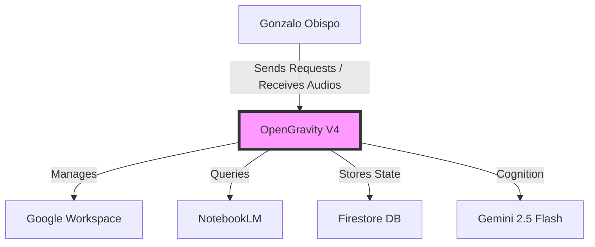

# C4 Context: OpenGravity V4

## System Overview
**OpenGravity V4** is an autonomous, state-machine driven digital workforce orchestrator. It manages user requests via Telegram, utilizing a centralized skills library and Google Workspace integration to perform complex, long-running tasks.

## Personas
- **Gonzalo Obispo (User)**: The primary human operator. Interacts with the system via Telegram to delegate tasks, manage schedule, and query research.
- **Programmatic Users (MCP Clients)**: Other AI agents or systems that might interface with OpenGravity's services.

## System Features
- **Autonomous Task Execution**: Breaking down long requests into actionable steps.
- **Google Workspace Orchestration**: Deep integration with Gmail and Calendar.
- **Knowledge Retrieval**: Bridging private knowledge from NotebookLM.
- **Safety & Reliability**: Multi-layered guard rails (Deterministic Planning, Safety Guards).

## System Context Diagram

## Related Documentation
- [Container Documentation](./c4-container.md)
